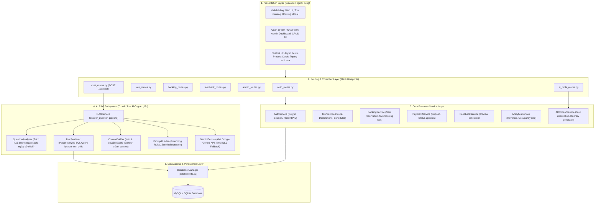

# Tài Liệu Thiết Kế Kiến Trúc Hệ Thống (System Architecture Specification)

Tài liệu này đặc tả kiến trúc phần mềm cho **Hệ thống Quản lý Tour Du lịch Tích hợp AI (TourAI - Đề tài 17)** theo chuẩn `architecture-design` skill.

---

## 1. Phong cách kiến trúc (Architectural Style)
Hệ thống được thiết kế theo mô hình **Kiến trúc Phân lớp (Layered Architecture / Modular Monolith)** kết hợp hệ thống con **Retrieval-Augmented Generation (RAG)** chuyên biệt cho AI.
Mô hình này tối ưu hóa tính tách biệt trách nhiệm (Separation of Concerns), dễ bảo trì, dễ kiểm thử và loại bỏ hoàn toàn nguy cơ AI bịa đặt dữ liệu (Zero Hallucination).

---

## 2. Trách nhiệm của các thành phần (Component Responsibilities)

| Tầng (Layer) | Thành phần | Trách nhiệm chính |
|---|---|---|
| **Presentation** | Templates (`templates/*.html`), Static (`static/css/`, `static/js/`) | Hiển thị giao diện người dùng tương thích đa thiết bị, bắt sự kiện, gửi request API không đồng bộ. |
| **Routing** | Flask Blueprints | Tiếp nhận HTTP Request, xác thực quyền truy cập (RBAC), kiểm tra tính hợp lệ dữ liệu đầu vào (Input validation), trả về HTML hoặc JSON. |
| **Service** | `booking_service.py` | Quản lý quy trình đặt chỗ, tính toán tiền, trừ số chỗ trống bằng database lock, hủy tour và hoàn trả chỗ. |
| **Service** | `tour_service.py` | Quản lý điểm đến, tour, lịch trình và danh sách đợt khởi hành. |
| **Service** | `auth_service.py` | Quản lý người dùng, băm mật khẩu bảo mật (bcrypt/pbkdf2), kiểm tra phân quyền người dùng. |
| **RAG** | `question_analyzer.py` | Phân tích câu hỏi tiếng Việt tự nhiên thành Structured Intent JSON (khoảng giá, điểm đến, số ngày, từ khóa). |
| **RAG** | `tour_retriever.py` | Nhận Intent, tạo câu lệnh SQL có tham số (parameterized query) để tìm các tour còn chỗ (`available_seats > 0`). |
| **RAG** | `context_builder.py` | Nhận kết quả từ Retriever, trích lọc thông tin cần thiết, định dạng thành văn bản ngắn gọn, chính xác. |
| **RAG** | `prompt_builder.py` | Gắn context vào System Prompt với các quy tắc ràng buộc nghiêm ngặt: "Chỉ trả lời dựa trên CONTEXT, tuyệt đối không bịa tour/giá". |
| **RAG** | `gemini_service.py` | Gửi prompt đến Gemini API qua biến môi trường an toàn, có timeout, xử lý ngoại lệ và fallback. |
| **Data Access** | `database/db.py` | Quản lý kết nối CSDL (Connection pool, cursor), hỗ trợ linh hoạt cả MySQL và SQLite. |

---

## 3. Ranh giới bảo mật & Cơ chế cách ly (Security Boundaries)
1. **Cô lập API Key:**
   - Client-side (JavaScript) tuyệt đối KHÔNG có quyền truy cập hay chứa Gemini API Key.
   - Toàn bộ lời gọi tới AI phải thông qua endpoint nội bộ `POST /api/chat`.
2. **Ngăn chặn SQL Injection:**
   - 100% các câu truy vấn cơ sở dữ liệu trong `TourRetriever` và các `Service` đều dùng Parameterized Query (`%s` hoặc `?`), không bao giờ ghép chuỗi (string concatenation).
3. **Kiểm soát truy cập (RBAC):**
   - Sử dụng decorator `@login_required` và `@roles_required(['ADMIN', 'STAFF'])` cho các route quản trị.
4. **Cô lập RAG với Database:**
   - `GeminiService` KHÔNG có kết nối tới cơ sở dữ liệu. Gemini chỉ nhận Context dạng text do `ContextBuilder` cung cấp. Điều này ngăn chặn triệt để nguy cơ Prompt Injection làm rò rỉ dữ liệu hoặc phá hoại CSDL.

---

## 4. Ma trận ánh xạ Yêu cầu sang Kiến trúc (Traceability Matrix)

| Yêu cầu (Requirement ID) | Thành phần kiến trúc đảm nhiệm (Component) |
|---|---|
| FR-001, FR-002, FR-003 | `auth_routes.py`, `auth_service.py`, bảng `users` |
| FR-005, FR-006 | `tour_routes.py`, `tour_service.py`, bảng `destinations`, `tours` |
| FR-007 | `ai_tools_routes.py`, `ai_content_service.py`, `gemini_service.py` |
| FR-008, FR-009, FR-010 | `booking_service.py`, `tour_schedules` (locking transaction) |
| FR-011, FR-012, FR-013 | `booking_routes.py`, `booking_service.py`, bảng `bookings` |
| FR-015, FR-016 | `payment_service.py`, `booking_service.py`, bảng `payments` |
| FR-017, FR-018 | `admin_routes.py`, bảng `tour_guides`, `guide_assignments` |
| FR-019, FR-020 | `feedback_routes.py`, `feedback_service.py`, bảng `feedbacks` |
| FR-021 | `admin_routes.py`, `analytics_service.py` |
| FR-022, FR-023, FR-024, FR-025 | `chat_routes.py`, `rag_service.py`, `question_analyzer.py`, `tour_retriever.py`, `context_builder.py`, `prompt_builder.py`, `gemini_service.py` |

