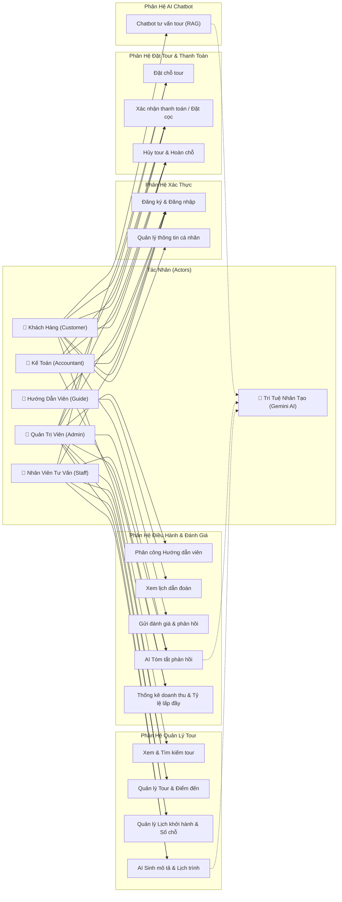
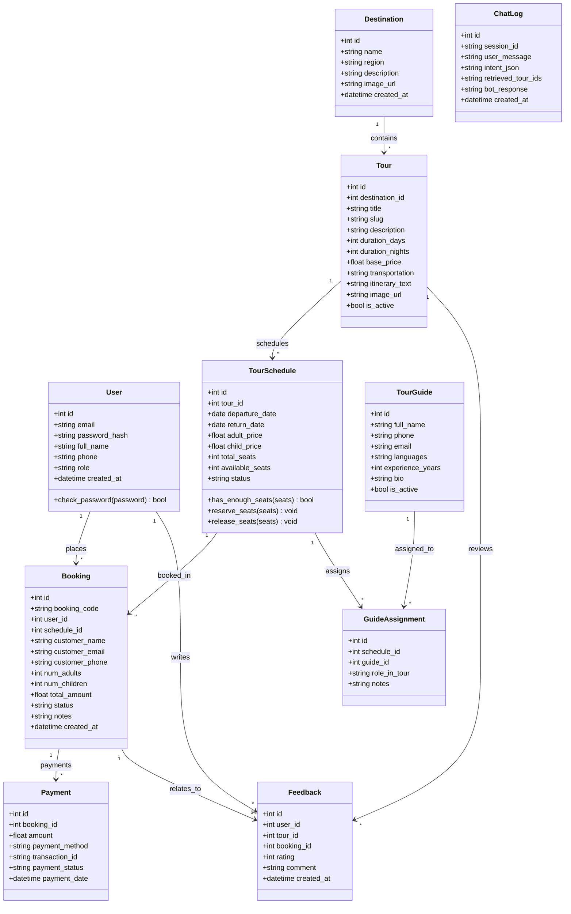
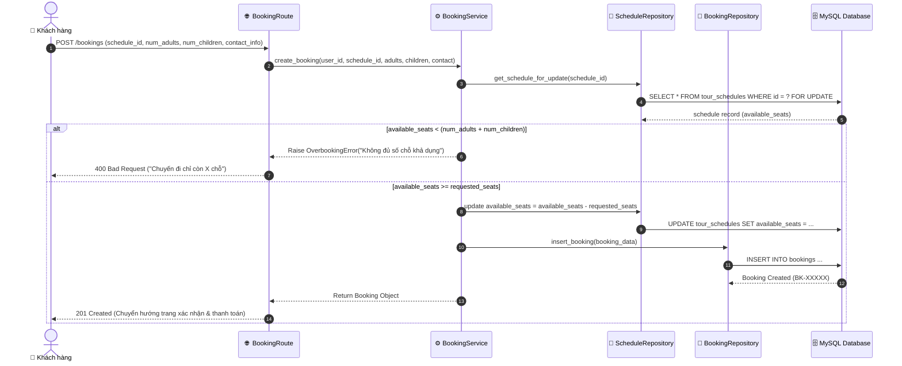
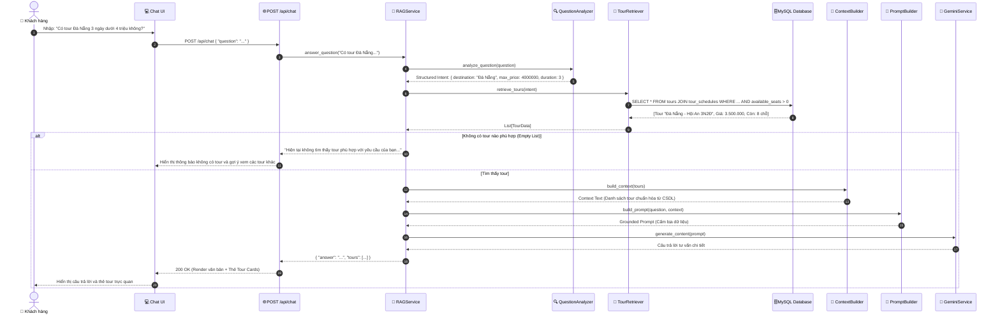
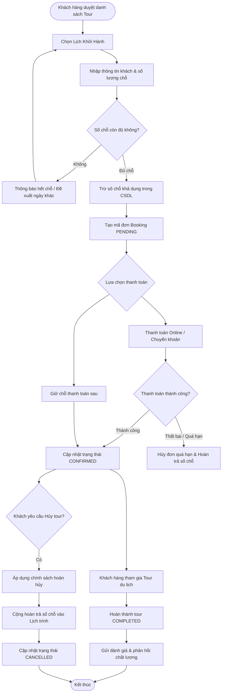
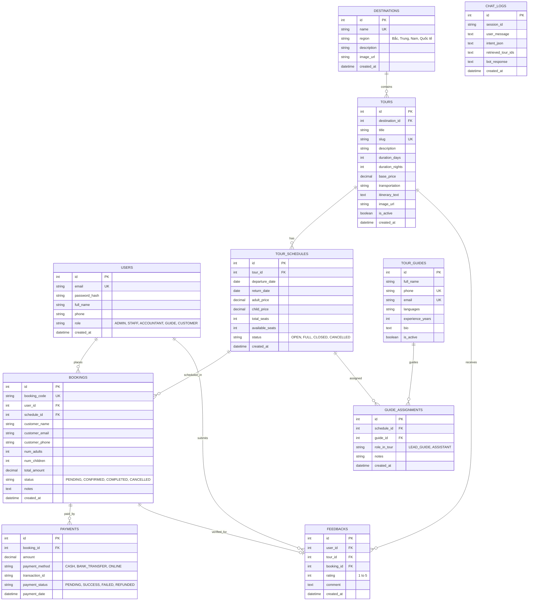

# Tài Liệu Thiết Kế Biểu Đồ & Bảng UML (UML Diagrams Specification)

Tài liệu này được tạo dựa trên `uml-design` skill, mô hình hóa toàn diện hệ thống quản lý tour du lịch tích hợp AI (Đề tài 17) bao gồm: Use Case Diagram, Class Diagram, Sequence Diagrams, Activity Diagrams và Entity-Relationship Diagram (ERD).

---

## 1. Biểu đồ Use Case (Use Case Diagram)

### 1.1 Sơ đồ tổng quan phân hệ và tác nhân

### 1.2 Bảng mô tả chi tiết các Use Case chính

| Mã Use Case | Tên Use Case | Tác nhân chính | Tiền điều kiện | Hậu điều kiện |
|---|---|---|---|---|
| `UC-01` | Đặt chỗ tour (Booking) | Khách hàng | Khách đã chọn đợt khởi hành còn chỗ (`available_seats > 0`) | Tạo bản ghi booking, giảm số chỗ trống tương ứng |
| `UC-02` | Hủy đặt chỗ (Cancel Booking) | Khách hàng / Kế toán | Đơn đặt chỗ ở trạng thái PENDING hoặc CONFIRMED | Đơn chuyển CANCELLED, hoàn trả số chỗ về lịch trình |
| `UC-03` | Chatbot tư vấn tour (RAG) | Khách hàng | Người dùng nhập câu hỏi tự nhiên | Chatbot trả lời thông tin chính xác từ CSDL, không bịa |
| `UC-04` | AI sinh mô tả tour | Nhân viên / Admin | Nhân viên nhập điểm đến, từ khóa | AI sinh đoạn văn mô tả chuẩn SEO và lịch trình chi tiết |
| `UC-05` | AI tóm tắt phản hồi | Admin / Quản lý | Đã có các phản hồi đánh giá trong CSDL | AI sinh báo cáo tổng hợp ưu/nhược điểm dịch vụ |

---

## 2. Biểu đồ Lớp (Class Diagram)

---

## 3. Biểu đồ Trình tự (Sequence Diagrams)

### 3.1 Quy trình Đặt tour & Kiểm soát số chỗ (Booking & Capacity Control)

### 3.2 Quy trình Chatbot RAG Tư vấn Tour (Zero Hallucination)

---

## 4. Biểu đồ Hoạt động (Activity Diagram)

### Vòng đời Đặt tour - Thanh toán - Hủy tour

---

## 5. Biểu đồ Thực thể Liên kết (Entity-Relationship Diagram - ERD)

